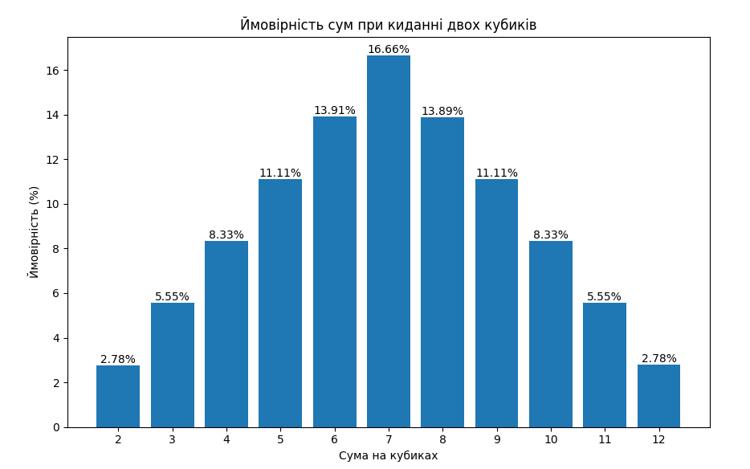

# Завдання 7. Метод Монте-Карло

### Опис завдання

Було реалізовано алгоритм моделювання кидання двох ігрових кубиків за допомогою методу Монте-Карло.
Програма виконує велику кількість симуляцій кидків двох кубиків, обчислює суму чисел, які випадають на кубиках, підраховує кількість появ кожної можливої суми та визначає її ймовірність.

На основі отриманих результатів побудовано графік імовірностей сум при киданні двох кубиків.

---
### Результати
Кількість експериментів: `10 000 000`

#### Порівняння аналітичних та отриманих значень сум при киданні двох кубиків, використовуючи метод Монте-Карло:
| Сума | Кількість комбінацій | Аналітична ймовірність | Ймовірність Монте-Карло |
| ---- | -------------------- | ---------------------- |-------------------------|
| 2    | 1                    | 2.78%                  | 2.7760%                 |
| 3    | 2                    | 5.56%                  | 5.5533%                 |
| 4    | 3                    | 8.33%                  | 8.3306%                 |
| 5    | 4                    | 11.11%                 | 11.1085%                |
| 6    | 5                    | 13.89%                 | 13.9131%                |
| 7    | 6                    | 16.67%                 | 16.6635%                |
| 8    | 5                    | 13.89%                 | 13.8871%                |
| 9    | 4                    | 11.11%                 | 11.1052%                |
| 10   | 3                    | 8.33%                  | 8.3322%                 |
| 11   | 2                    | 5.56%                  | 5.5523%                 |
| 12   | 1                    | 2.78%                  | 2.7776%                 |

Отримані результати практично збігаються з аналітичними розрахунками. Найбільшу ймовірність має сума 7, оскільки її можна отримати найбільшою кількістю комбінацій. Найменшу ймовірність мають суми 2 та 12, оскільки вони утворюються лише однією комбінацією.

Незначні відхилення між результатами симуляції та аналітичними значеннями пояснюються випадковим характером методу Монте-Карло. При збільшенні кількості експериментів точність результатів підвищується.